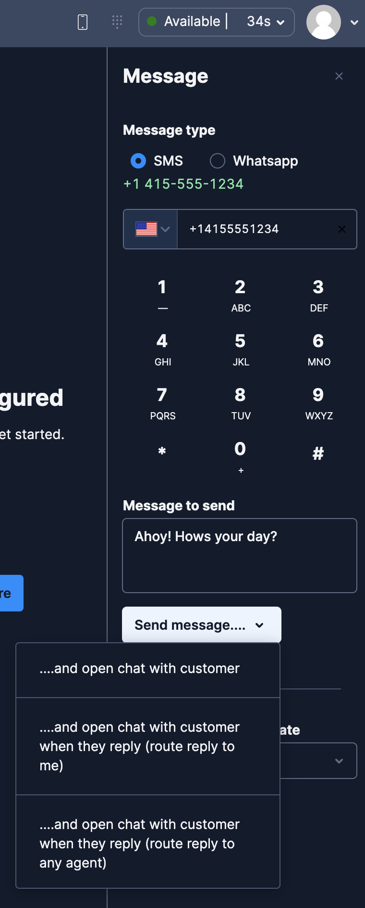
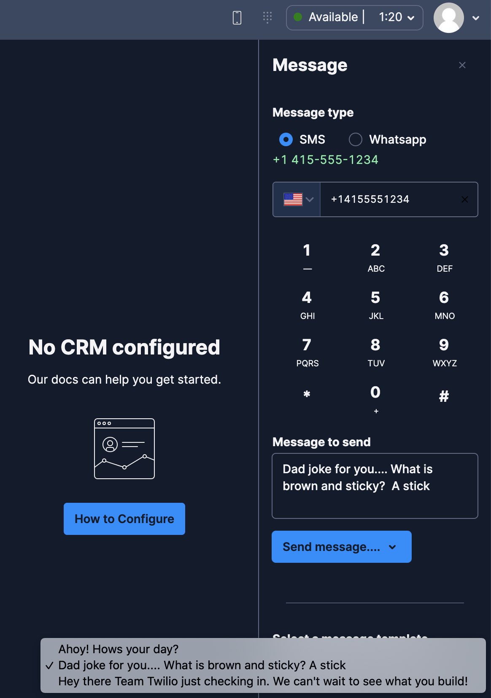

# Outbound Messaging Panel Plugin for Flex 2.0

## Disclaimer

**This software is to be considered "sample code", a Type B Deliverable, and is delivered "as-is" to the user. Twilio bears no responsibility to support the use or implementation of this software.**

## Pre-Requisites

**This plugin makes use of Conversations Based Messaging and Paste in Flex which is a dependency on Flex 2.0**

## WhatsApp Templates to Content Templates (Breaking change April 1, 2025)

**Prior to April 1, 2025 outbound message bodies that matched a WhatsApp template could be sent outside of [the 24 hour window](https://www.twilio.com/docs/whatsapp/key-concepts#the-24-hour-window-or-24-hour-session).**

After April 1, 2025 content templates will need to be specified implicity and this plugin does not currently support this.

Additional details are available here [Upgrading WhatsApp Templates to Content Templates](https://help.twilio.com/articles/19816296822299-Upgrading-WhatsApp-Templates-to-Content-Templates)

_There is an optional .env parameter to enable a feature that allows content templates to be selected rather than providing a free form message body when uing WhatsApp. This is described in more detail below._

## Solution Overview

This plugin is intended to demonstrate the [Interactions API](https://www.twilio.com/docs/flex/developer/conversations/interactions-api), [Flex Conversations](https://www.twilio.com/docs/flex/conversations) and [Paste](https://paste.twilio.design/). The outbound SMS and WhatsApp code was inspired by the examples in [this blog on Flex Conversations](https://www.twilio.com/blog/flex-conversations-public-beta)

A new panel is added that has a similar look and feel to the native outbound voice panel but handles the outbound messaging use case.

When sending the message the agent has the option to:

- Open a chat (creates a channel, adds the message and creates a task with the agent to open a message based task)
- Send a message and wait for the customer to reply (create a channel, add the message and setup a studio webhook to handle the inbound)
  - When the reply comes in route to the agent that sent the message (or)
  - When the reply comes in route to any agent

To route the inbound customer message task back to the agent that sent the message is achieved by adding the worker friendly name to the conversation channels attributes and studio can then set the task attributes as required.

## Canned Messages and WhatsApp Template notes

As well as providing the option to add a free form message there is a drop down to select a canned/template message. Note that for WhatsApp you can only send a free form (non WhatsApp approved template message) within a 24 hour session window where the recipient has initiated a message to your number.

Our docs cover WhatsApp Templates in more detail [here.](https://www.twilio.com/docs/whatsapp/tutorial/send-whatsapp-notification-messages-templates)

Note this is a POC/example of how to implement outbound messaging. In a production deployment consideration should be give to:

- Provide additional logic to not allow free form messages outside of the 24 hour session (one option could be to track whatsapp numbers and last inbound message in a Sync map. (Consider Sync RPS and object limits in large applications) )
- Outside of the 24 hour session enforce that templates can be used and allow for dynamic content to be inserted into the outbound template message according to the template placeholders {{...}}
- The canned messages/templates are hard coded in src/utils/templates.js. A more flexible option would be to have an endpoint that the plugin can reach out to GET the current templates from a config file.

## Actions

The plugin adds two [Flex actions](https://www.twilio.com/docs/flex/developer/ui/actions) that could be reused - for example to implement Click to Message.

- ToggleOutboundMessagePanel

  Toggles the panel - the plugin uses this from the Message icon in the main header

- SendOutboundMessage

  Sends the message and is triggered from the Send message button

  ```
  payload :
  {destination (To Number),
  callerId (From Number)
  routeToMe (bool flag to indicate if inbound message should route to this agent)},
  openChat (bool to indicate if message chat should open when sending the message),
  body (the message to send)
  ```

## Screenshots





## Setup

### Pre-Requisites for Setup

- An active Twilio account with Flex provisioned. Refer to the [Flex Quickstart](https://www.twilio.com/docs/flex/quickstart/flex-basics#sign-up-for-or-sign-in-to-twilio-and-create-a-new-flex-project") to create one.
- A phone number or Whatsapp sender [configured for Flex Conversations](https://www.twilio.com/docs/flex/admin-guide/setup/conversations/manage-conversations-sms-addresses)
- npm version 9.0.0 or later installed (type `npm -v` in your terminal to check)
- Node.js version 18 or later installed (type `node -v` in your terminal to check)
- [Twilio CLI](https://www.twilio.com/docs/twilio-cli/quickstart#install-twilio-cli) along with the [Flex CLI Plugin](https://www.twilio.com/docs/twilio-cli/plugins#available-plugins) and the [Serverless Plugin](https://www.twilio.com/docs/twilio-cli/plugins#available-plugins). Run the following commands to install them:

  ```bash
  # Install the Twilio CLI
  npm install twilio-cli -g
  # Install the Serverless and Flex as Plugins
  twilio plugins:install @twilio-labs/plugin-serverless
  twilio plugins:install @twilio-labs/plugin-flex
  ```

### Serverless

Deploy the sendOutboundSMS function

```
cd serverless/outbound-messaging
twilio serverless:deploy
```

and note the domain that is created (we will add this to the plugin config)

### Run Plugin Locally

Copy the template.env to .env and update the sids, phone number to be a Twilio number within the account and the domain that was created during the Serverless deployment.

```
FLEX_APP_TWILIO_SERVERLESS_DOMAIN=https://xxx.twil.io
FLEX_APP_WORKSPACE_SID=WSxxx  # Used for creating an outbound chat task
FLEX_APP_WORKFLOW_SID=WWxxx  # Used for creating an outbound chat task
FLEX_APP_QUEUE_SID=WQxxx  # Used for creating an outbound chat task
FLEX_APP_INBOUND_STUDIO_FLOW=FWxxx  # Used for handling the reply of outbound chats without a task
FLEX_APP_TWILIO_FROM_NUMBER=+1xxxx
FLEX_APP_TWILIO_WHATSAPP_FROM_NUMBER=+1xxxx
```

```
# Install Dependencies
npm install

# Start Flex Plugins
twilio flex:plugins:start
```

### Deploy Plugin

After testing the plugin locally you can deploy the plugin to your account using the [Flex Plugins CLI](https://www.twilio.com/docs/flex/developer/plugins/cli/deploy-and-release)

### Studio SendToFlex

To handle the use case of inbound replies from the customer needing to create a task and optionally routing it to the agent that initiated the outbound message we will make use of the sendOutboundSMS function populating the conversations channel attributes.

These are then available in the trigger and modifying the SendToFlex attributes as below will populate the task attributes for the TaskRouter Workflow.

```
{"KnownAgentRoutingFlag":"{{trigger.conversation.ChannelAttributes.KnownAgentRoutingFlag}}", "KnownAgentWorkerSid":"{{trigger.conversation.ChannelAttributes.KnownAgentWorkerSid}}"}
```

### TaskRouter Workflow

This workflow assumes that studio has populated the Task Attributes with

- AttributesKnownAgentRoutingFlag
- KnownAgentWorkerFriendlyName

```
{
  "task_routing": {
    "filters": [
      {
        "filter_friendly_name": "Known Agent Routing Filter",
        "expression": "KnownAgentRoutingFlag == \"true\"",
        "targets": [
          {
            "queue": "WQxxxx",
            "known_worker_sid": "task.KnownAgentWorkerSid"
          }
        ]
      }
    ],
    "default_filter": {
      "queue": "WQxxxx"
    }
  }
```

### Content Templates

As noted above there is a breaking change April 1, 2025 which means that the initial WhatsApp message from Twilio to the Customer that is outside of the 24 hour session must be a template. Prior to Apri 1, 2025 Twilio would take a message body that was equivalent to a template body and automatically select the template. The breaking change requires the template SID to be passed when creating the message.

Kudos to @cullenwatson for his contribution that has been leveraged to add initial support for sending content templates that don't require variables.

To enable this limited Content Template support update the plugin .env file _FLEX_APP_USE_CONTENT_TEMPLATES_ flag.

In addition there is an optional asset file that can be used to limit the Content Templates that will be returned to the plugin.

The contentTemplateFilters asset file can be updated with the account sid and list of Content Template SIDs (HXxxx). In this case for ACxxx only Content Templates HXxxx and HXyyy would be available for selection.

```
 {
  enabled: true,
  accounts: {
    ACxxx: [
      "HXxxx",
      "HXYYY",
    ],
  },
};
```
